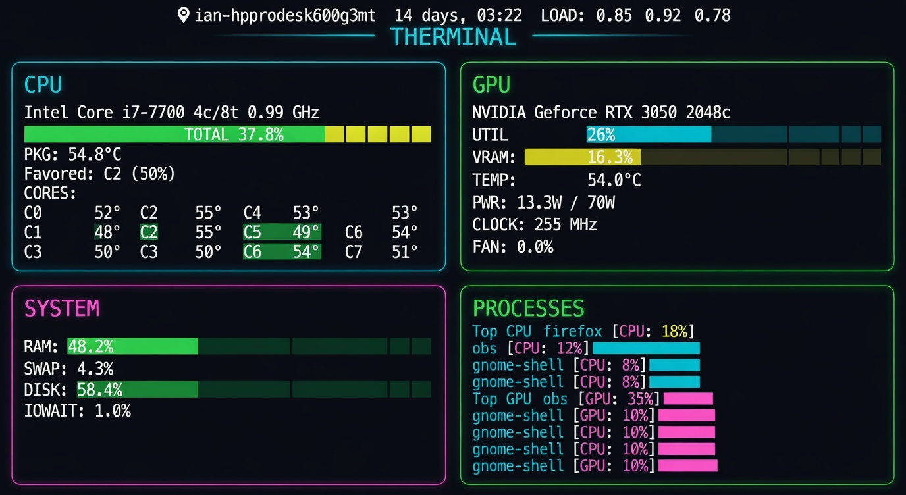

# therminal

A beautiful, fast terminal dashboard for CPU + GPU load, temperature, power, and system health — with tight integration to load averages and uptime.



## Features

- **Live updating** every ~0.6–1s by default
- **CPU panel**
  - Overall utilization with colored bar
  - All logical cores shown as compact bars
  - Package + average core temperatures (color coded)
  - Current frequency
  - System RAM usage
- **GPU panel** (NVIDIA)
  - Utilization + VRAM bars
  - Temperature (aggressive thresholds for GPUs)
  - Power draw / limit
  - Fan speed %
  - **Integrated top processes** (now inside the panel)
    - Uses `nvidia-smi pmon` for real SM utilization % + memory bandwidth
    - Shows memory allocated + activity bars driven by actual GPU usage
    - Smart process names via psutil (shows scripts for python, etc.)
    - Top 2 most active processes (space-constrained inside the panel)
- **Header**
  - Hostname + readable uptime
  - 1/5/15 load averages (color coded against core count)
  - Live clock
- Keyboard control: `+`/`-` to change refresh rate, `q` to quit

## Requirements

- Python 3.10+
- `rich` + `psutil`
- NVIDIA users: `nvidia-smi` in PATH (most Linux installs)

## Quick start (recommended)

```bash
# Using uv (fastest, no permanent install)
uv run --with rich --with psutil therminal.py

# Or with pip
pip install rich psutil
python3 therminal.py
```

## Usage

```bash
python3 therminal.py                 # default 1.0s refresh
python3 therminal.py -i 0.5          # faster updates
python3 therminal.py --interval 2    # slower
```

### Controls (while running)

| Key       | Action                  |
|-----------|-------------------------|
| `q` / `Q` | Quit                    |
| `+` `=`   | Faster refresh          |
| `-` `_`   | Slower refresh          |
| `r`       | Force refresh           |
| `Ctrl+C`  | Quit                    |

## Color logic

- **Utilization**: green (<50%) → yellow (50-80%) → red (>80%)
- **CPU temps**: green (<70°C) → yellow (70-85°C) → red
- **GPU temps**: green (<65°C) → yellow (65-80°C) → red (they run hotter)
- **Load average**: colored relative to logical core count

## Notes

- Works great on both light and dark terminals (heavy use of direct color names).
- If no NVIDIA GPU is present it gracefully shows a "CPU only" view.
- AMD/Intel GPU support is not implemented yet (contributions welcome).
- Reads temperatures from `psutil.sensors_temperatures()` (works on most Linux systems with `coretemp`).

## Development

Single-file script. Hack on it freely.

```bash
python3 therminal.py
```

## License

MIT (or do whatever).

---

Built as a first Grok test project. Enjoy the pretty bars. 🔥
